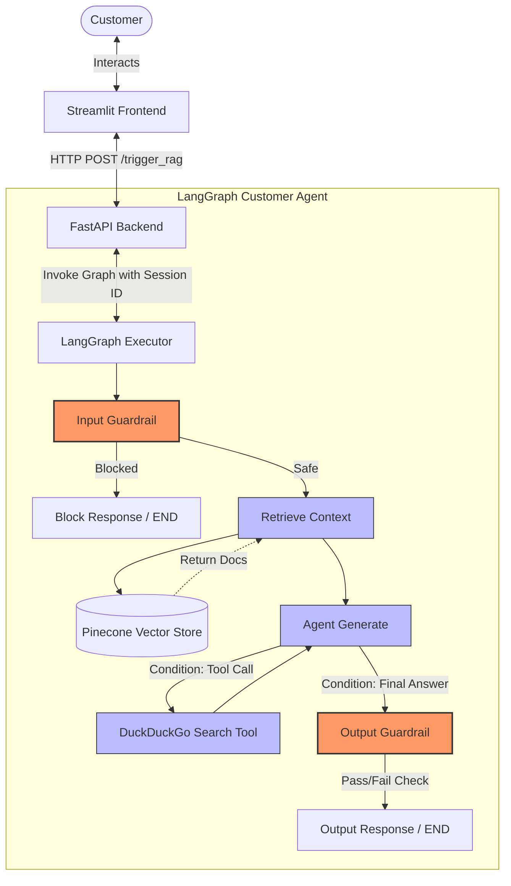

# ShopEasy Customer Support Agent

ShopEasy Customer Support Agent is an AI-powered customer service bot designed to answer customer inquiries about company policies. Built on a Retrieval-Augmented Generation (RAG) architecture using **LangGraph**, **FastAPI**, **Streamlit**, and **Pinecone**, it ensures policy-compliant, safe, and context-aware responses.

---

## 🚀 Key Features

- **LangGraph State Machine Orchestration**: Manages the conversation flow statefully and handles fallback logic dynamically.
- **Dual-Layer Guardrails**:
  - **Input Guardrail**: Identifies and blocks prompt injections, jailbreaks, and requests for internal instructions using both rule-based pattern matching and LLM verification.
  - **Output Guardrail**: Validates the agent's answer against hallucinated policies, PII leakage, and toxic responses before presenting it to the customer.
- **Context Retrieval via Pinecone**: Uses HuggingFace embeddings (`all-MiniLM-L6-v2`) to perform semantic search on the official company policy documentation.
- **Web Search Fallback**: Automatically invokes a DuckDuckGo Search tool when internal documentation is insufficient.
- **Conversation Memory**: Remembers past user interactions within the same session using LangGraph's `MemorySaver`.
- **Streamlit Chat Interface**: A polished frontend chat interface with real-time word streaming and message history.

---

## 📐 System Architecture

The following diagram illustrates the flow of a customer query through the system:



For a deeper dive into the system design, components, and node logic, check the separate [ARCHITECTURE.md](file:///d:/Projects/day_28_final_project/shopEasy-customer-support-agent/ARCHITECTURE.md) documentation.

---

## 📁 Project Structure

```text
├── frontend/
│   └── frontend.py           # Streamlit chat interface
├── resources/
│   └── shopeasy_policy.pdf   # Internal company policy documents
├── src/
│   └── images/
│       └── customer_support.png # Logo image for the UI
├── tests/
│   └── evaluation.py         # RAGAS-based evaluation suite
├── utils/
│   ├── graph.py              # LangGraph compilation & node logic
│   └── rag.py                # Pinecone indexing, HuggingFace embeddings, LLM configuration, & search tools
├── main.py                   # FastAPI backend server
├── schema.py                 # Pydantic schema validation for endpoints
├── requirements.txt          # Python dependencies
├── Dockerfile                # Multi-stage-like container build for apps
├── docker-compose.yml        # Orchestration configuration for api and frontend
└── .env.example              # Template for environment configuration
```

---

## ⚙️ Setup & Installation

### Prerequisites

Ensure you have the following API keys ready:
- **Groq Cloud API Key** (for Llama-3.3-70B model execution)
- **Pinecone API Key** (for Vector Store index storage)

### 1. Environment Configuration

Create a `.env` file in the root directory and populate it with your keys:

```env
GROQ_API_KEY=your_groq_api_key_here
PINECONE_API_KEY=your_pinecone_api_key_here
PDF_PATH=resources/shopeasy_policy.pdf
LOG_PATH=main.log
```

---

### Method A: Running with Docker (Recommended)

To run the entire system (both backend and frontend) inside Docker containers:

1. **Build and start the containers**:
   ```bash
   docker compose up --build
   ```
2. **Access the applications**:
   - **Streamlit Frontend Chat UI**: http://localhost:8501
   - **FastAPI Swagger Docs**: http://localhost:8000/docs

---

### Method B: Running Locally (Without Docker)

1. **Create and activate a virtual environment**:
   ```bash
   python -m venv venv
   # On Windows
   venv\Scripts\activate
   # On macOS/Linux
   source venv/bin/activate
   ```

2. **Install dependencies**:
   ```bash
   pip install -r requirements.txt
   ```

3. **Configure Frontend URL (Local only)**:
   By default, the Streamlit app connects to `http://rag-api:8000` (Docker networking). Since you are running locally, update the `API_URL` variable in [frontend/frontend.py](file:///d:/Projects/day_28_final_project/shopEasy-customer-support-agent/frontend/frontend.py#L7) to:
   ```python
   API_URL = "http://localhost:8000/trigger_rag"
   ```

4. **Start the FastAPI Backend**:
   ```bash
   uvicorn main:app --host 127.0.0.1 --port 8000 --reload
   ```

5. **Start the Streamlit Frontend**:
   ```bash
   streamlit run frontend/frontend.py --server.port 8501
   ```
   Open http://localhost:8501 in your browser.

---

## 📊 Evaluation Suite

A RAGAS evaluation script is provided in [tests/evaluation.py](file:///d:/Projects/day_28_final_project/shopEasy-customer-support-agent/tests/evaluation.py). It tests the agent against 22 predefined customer service scenarios and scores responses on **Answer Relevancy**.

To run the evaluation:
1. Ensure the FastAPI backend is running locally at `http://localhost:8000`.
2. Run the evaluation script:
   ```bash
   python tests/evaluation.py
   ```
3. The results will be printed to the console and saved as `evaluation_results.csv`.
